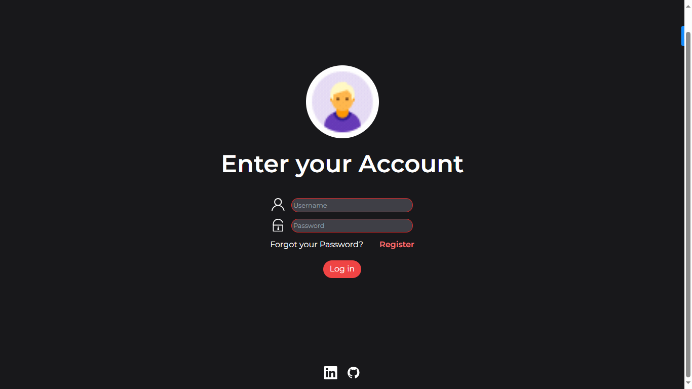

# Authentication UI 

If you're app need to create an user and them need to sign up, you need this template to can make it real.




## Getting Started


### Prerequisites


* HTML/CSS
* JavaScript
* React.js
* Tailwind Css
* Vite.js
* Three.js

### Installation

A step by step guide that will tell you how to get the development environment up and running.

```
$ npm install (Install node dependecies)
$ npm run dev (Run server)
```


## Deployment

[click here to check live version](https://serene-cat-40df55.netlify.app/)

## Additional Documentation and Acknowledgments

* Pinteres
* tailwind
* Drei
* etc...
